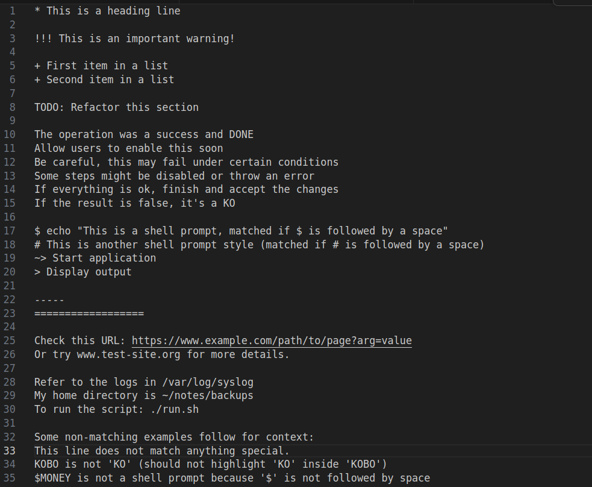
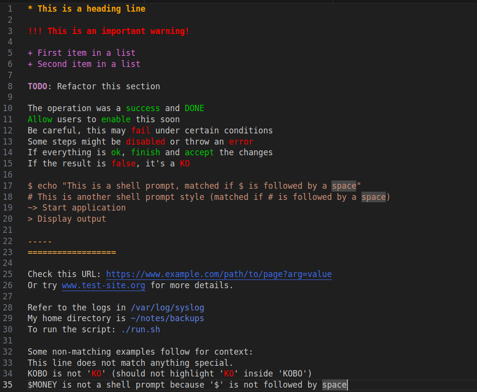

## Custom Syntax Highlighting for VS Codium (also compatible with VS Code)

This extension provides simple, visually appealing syntax highlighting tailored for note-taking. It is set as the **default language for unsaved files** and for all `.txt` files.  

**Note:** This highlighting is best viewed with a dark theme.

**Plain text:**



**With highlighting:**



---

### Installation

1. **Download** a snapshot of a repository's files as a zip file.
2. **Unzip** the archive.
3. **Copy** the `txt-syntax-highlighting-0.0.1` directory into the extensions folder for your VS Codium installation:

    - **Deb or snap package:**  
      `~/.vscode-oss/extensions/`
    - **Flatpak:**  
      `~/.var/app/com.vscodium.codium/data/vscode-oss/extensions/`
    - **Windows:**  
      `C:\Users\<YourUsername>\.vscode-oss\extensions\`

    _Example:_  
    ```sh
    cp -r txt-syntax-highlighting-0.0.1 ~/.vscode-oss/extensions/
    ```

    **Tip:** For Visual Studio Code, use `.vscode` instead of `.vscode-oss` in the folder path.

4. **Customize colors:**  
   Copy the `textMateRules` block from the provided `settings.json` into your own user settings:
   - Open the Command Palette with `Ctrl+Shift+P`
   - Type and select **"Open User Settings (JSON)"**
   - Paste the rules, for example:
     ```json
     "editor.tokenColorCustomizations": {
         "textMateRules": [
             {
                 "scope": "markup.heading",
                 "settings": {
                     "foreground": "#FFA500",
                     "fontStyle": "bold"
                 }
             }
             // ...other rules as needed
         ]
     }
     ```
   _A sample configuration for VS Codium is included in this repository._

5. **Apply changes:**  
   - Changes should take effect immediately.
   - You can verify the extension is installed by pressing `Ctrl+Shift+X` to open the Extensions view.
   - If the extension does not appear, restart VS Codium.

---

**Enjoy improved note-taking with custom syntax highlighting!**
